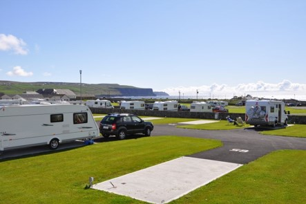
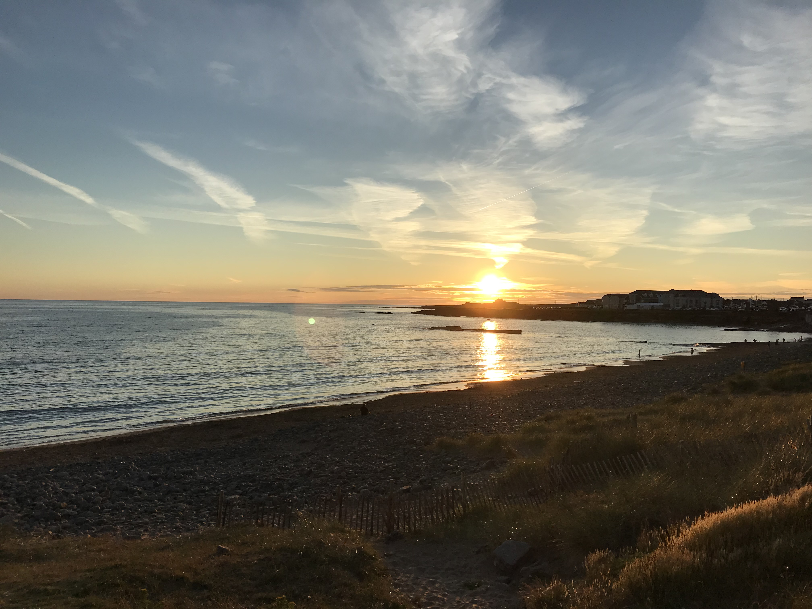
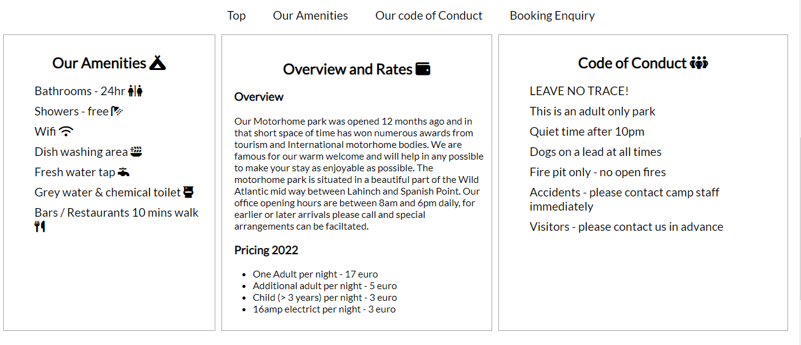
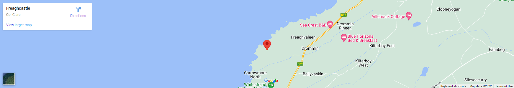
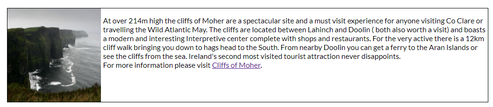
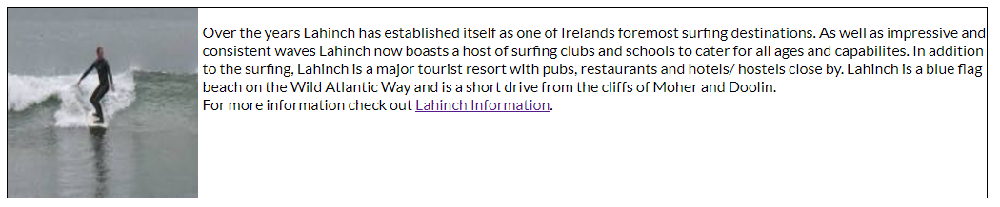
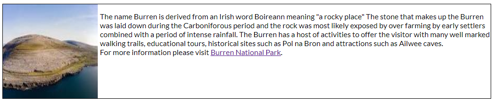
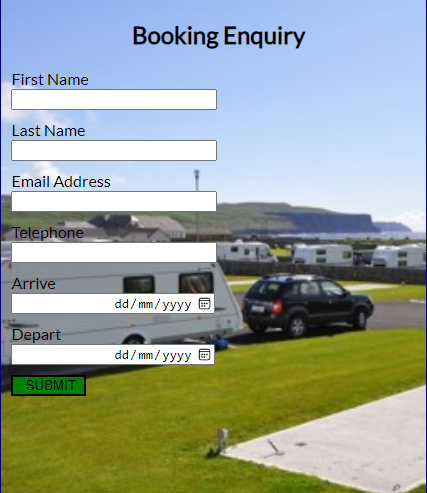
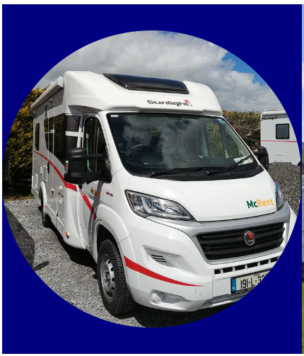

# West Clare Motorhome Park
The last number of years, possibly aided by the COVID pandemic and associated travel constraints, have seen an explosion in Motorhome ownership in Ireland. There have been three fundemantal responses to this growth, the first is a rise in the number of motorhome parks in Ireland or the expansion of traditional camp sites to cater for motorhomes. Secondly, slowly but surely some councils are seeing the benefit of creating Aires ( one night pull in points) in towns and villages to facilitate safe parking / waste diposal etc. Finally, some councils when faced with the sudden influx of motorhomes are reacting negatively and putting bars on parking facilities to restrict access to cars.

When a potential customer accesses a motorhome website, especially for a place they have not been before, they have a number of questions in mind that they need answered quickly and clearly. These questions include where exactly is the motohome park?, what facilities are available?, what are the site rules ? , how far is the site from a town etc, how much does it cost per night?  This website answers all those questions clearly on the landing page. The site then also facilitates further exploration of the locality and finally a booking request can be made. 

## Site Features
The following features are common to each of the website pages;

The page Banner shows the Motorhome banner and has three links - Home, Explore Locally and Booking Enquiry. Each page will be explained in more detail however these links enable the visitor to navigate seamlessly between the website pages.

The footer of the website is split into 3 sections. On the bottom left are links to popular social media websites, these website open in a separate tab. The centre section has a "Call to Action" to prompt a follow up from a potential customer. The right hand bottom section gives the customer another opportunity to make a booking enquiry. 

### Landing Page Image

The landing page image shows a view of the ocean from the park, it is indicative of the type of scenery to be experienced when staying at the motorhome park. 

### Site Amenities section

This section details the facilities available at the park, some background on the park and a list of park rules / guidelines. A potential visitor can see quite quickly if the site fulfils some or all of their travel needs. At the top of this section there are links to enable the visitor to navigate to and from different sections of this page.

### Site location map

The site location map shows the visitor where the park is located and enables the user to plan on how to get there. This is an image right now rather than an active connection into Google maps. Future iteration of the page could have an active connection into Google maps to enable searching around the locality.

### Places to Explore section

This section gives a potential visitor an idea of some of the key attractions located near to the park. Right now there are 3 attractions listed, this could be expanded greatly in future iterations of the website.

### The cliffs of Moher
The cliffs of Moher are one of Irelands most popular tourist attractions and are on most visitors bucket lists whether an international or domestic visitor to the area. There is a link included which enables the curiouys visitor to dig deeper and find out more.

### Surfing in Lahinch
Lahinch offers everything in terms of the surfing experience. It is expected that many of the people that visit the motorhome website will have an interest in surfing or surfing lessons.

### The Burren
The Burren is another reason many people come to Clare. The area attracts hikers, botanists, tourists, fishermen etc. Again being close the Burren is an advantage for the Motorhome park. The website contains a link to enable a curious visitor to find out more about the Burren, this link opens in a new tab as do the others on this page. 

### The Booking Form
This page has two features. The first feature is a booking enquiry form, the visitor can fill in some basic details, planned arrival and departure dates and submit. The site owner will then respond with options. A future enhancement would be to allow the visitor to select a pitch, book and pay online in advance of arrival. Note each field in the booking form is a required field and cannot be submitted unless fully completed. 

This page also has an image of a Sunlight T64 motorhome sitting in one of our more private pitches. Note this image is hidden for mobile screens. 

## Future Enhancements
Active connection to Google maps location - to enable exploration of surrounding areas.

Addition of places to explore - further convince a prospective visitor that this is a great area to come and visit.

Automate booking and billing capability - enable start to end experience for the prospective visitor.

## Testing 

Prior to deploying the website the following testing was completed:

1.  Open website and ensure Landing page appears as expected - Passed 
2.  Landing Page - hover over nav links , should highlight and invert colours - Passed
3.  Landing Page - click nav links at top of page, should navigate to / from other pages - Passed.
4.  Landing Page - Park View should appear in center of main background image - Passed. 
5.  Landing Page - On page links should move to relevant sections of page - Passed.
6.  Landing Page - Image of map is readable and full width of screen - Passed.
7.  Landing Page - Footer located at bottom of screen below image - Passed.
8.  Landing Page - Footer, white text on black background for clarity - Passed.
9.  Landing Page - Footer, click each social media app, open in new tab - Passed. 
10. Landing Page - Footer, telephone number clear, easy to read - Passed.
11. Landing Page - Footer, click Booking Enquiry form, open Enquiry form page - Passed. 
12. Landing Page - Footer, once clicked, all links turn yellow - Passed.
13. Explore Locally - hover over nav links , should highlight and invert colours - Passed
14. Explore Locally - click nav links at top of page, should navigate to / from other pages - Passed.
15. Explore Locally - three evenly spaced sections on screed - Passed.
16. Explore Locally - Cliffs on Moher link, open in new tab - Passed.
17. Explore Locally - Lahinch Information link, open in new tab - Passed.
18. Explore Locally - Burren National Park link, open in new tab - Passed.
19. Explore Locally - Footer located at bottom of screen below image - Passed.
20. Explore Locally - Footer, white text on black background for clarity - Passed.
21. Explore Locally - Footer, click each social media app, open in new tab - Passed. 
22. Explore Locally - Footer, telephone number clear, easy to read - Passed.
23. Explore Locally - Footer, click Booking Enquiry form, open Enquiry form page - Passed. 
24. Explore Locally - Footer, once clicked, all links turn yellow - Passed.
25. Booking Enquiry - hover over nav links , should highlight and invert colours - Passed
26. Booking Enquiry - click nav links at top of page, should navigate to / from other pages - Passed.
27. Booking Enquiry - Motorhome image left and right, site image in center - Passed.
28. Booking Enquiry - Booking form appears on site image - Passed.
29. Booking Enquiry - click Submit, no fields completed, should see error - Passed.
30. Booking Enquiry - click Submit , any field blank , should see error - Passed.
31. Booking Enquiry - Click Submit, all fields complete, see receipt from Code Institute - Passed.
32. Booking Enquiry - Footer, white text on black background for clarity - Passed.
33. Booking Enquiry - Footer, click each social media app, open in new tab - Passed. 
34. Booking Enquiry - Footer, telephone number clear, easy to read - Passed.
35. Booking Enquiry - Footer, click Booking Enquiry form, open Enquiry form page - Passed. 
36. Booking Enquiry - Footer, once clicked, all links turn yellow - Passed.
37. Landing Page - mobile size, all elements clearly defined - Passed.
38. Landing Page - mobile size, Header nav links under main banner - Passed.
39. Landing Page - Mobile size, amenity , Overview, rules sections stacked on each other - Passed.
40. Landing Page - Mobile size, footer intact and readable - Passed.
41. Explore Locally - Mobile size, Header nav links under main banner - Passed.
42. Explore Locally - Mobile size, sections stacked as a column and readable - Passed.
43. Explore locally - Mobile size, footer intact and readable - Passed.
44. Booking Enquiry - Mobile size, motorhome images removed for clarity - Passed.
45. Booking Enquiry - Mobile size, form integrity maintained - Passed.
46. Booking Enquiry - Mobile size, footer intact and readable - Passed.

### Testing - Bugs

1. Data entry to Booking form is center located, may go off form.
    Issue fixed, removed a padding reference and increased element width.

### Validator Testing

HTML
* No errors were returned when passing through the official W3C validator

CSS
* No errors were returned when passing through the official Jigsaw validator

## Deployment

This site was deployed to GITHUB pages. The steps taken were as follows;
* In the GitHub repository, navigate to the Settings tab
* Click Pages on left sidebar.
* Under Build and Deployment , ensure Source dropdown says Deploy from a branch.
* Select Branch - main from dropdown

* Live link to site can be found here :         https://2macs.github.io/ProjectPortfolio1/
* Github link to project can be found here :    https://github.com/2macs/ProjectPortfolio1

## Credits

### Content
All the icons used on this website were found on https://fontawesome.com/
The Lato font type was found on https://fonts.googleapis.com/css2?family=Lato:ital,wght@0,400;1,300&family=Oswald&display=swap
The styling of the Nav bar was sourced as per the Love Running project - code Institute
The highlighting of nav items was as per the Coder Coffeehouse - code Institute
To position the 3 columns on the index page, a solution was located at https://stackoverflow.com/
Changing link colors once visited found here https://www.w3schools.com/html/html_links_colors.asphttps://www.w3schools.com/html/html_links_colors.asp
Guide to flexbox and how to use was reviewed here https://css-tricks.com/snippets/css/a-guide-to-flexbox/
Text book used as reference - HTML, CSS and Javascript All in One , Sams Teach Yourself.
Websites routinely used for problem solving include :
    https://www.w3schools.com/
    https://stackoverflow.com/
    https://www.geeksforgeeks.org/
    https://www.codecademy.com/

### Media
* Main on banner on landing page - Ann McMahon (spouse).
* All icons from fontawesome.
* Map image on landing page is a snip from Google Maps. 
* Motorhome image on booking enquiry form - Ann McMahon (spouse)
* Site image on booking form is from http://www.doolincamping.com/facilities/
* Image of surfer from here https://encrypted-tbn0.gstatic.com/images?q=tbn:ANd9GcTGXypcDFjojnrp3rkdwhpGbXzkSFIHbqs54eyL7ZO1hw&s
* Image of the Burren and Cliff of Moher freely - source not recorded. Freely available online.

End of README

